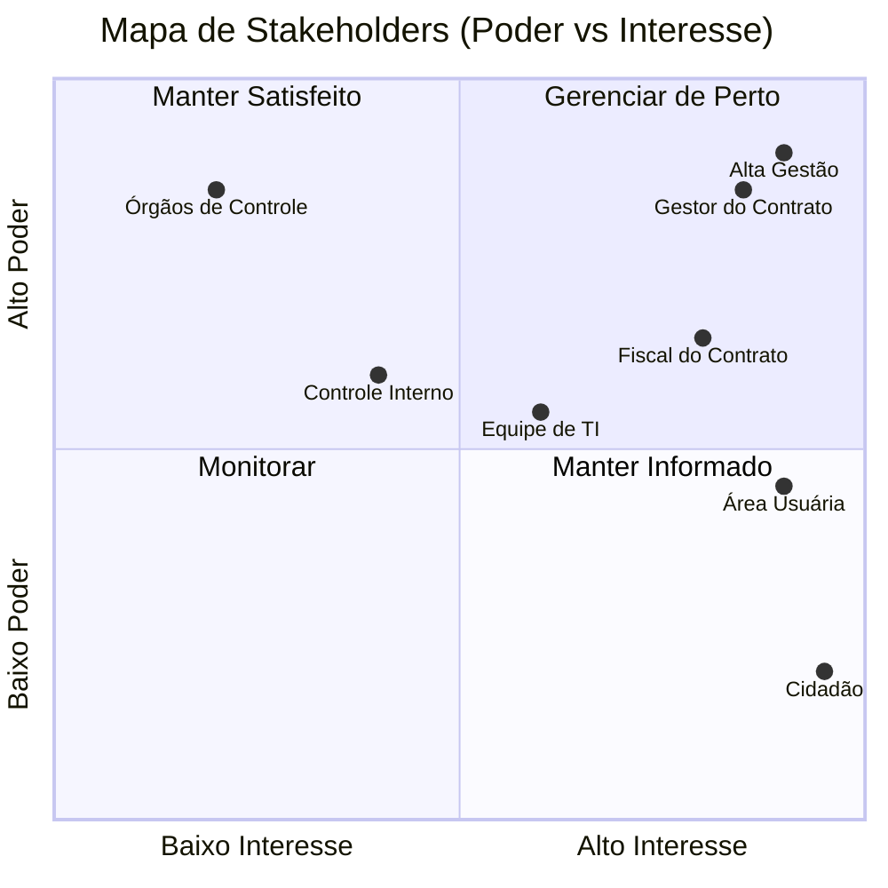

## 4. Gestão de Stakeholders

### 4.1. Definição dos Atores e Influência

1.  **Autoridade Competente / Alta Gestão:** Decisão estratégica e política.
2.  **Gestor do Contrato:** Administração jurídica e equilíbrio contratual.
3.  **Fiscal do Contrato:** Validação técnica e ateste de conformidade.
4.  **Área Usuária:** Donos do processo e fonte primária de requisitos.
5.  **Equipe de TI do Órgão:** Segurança, infraestrutura e integração.
6.  **Controle Interno / CGM:** Conformidade preventiva e compliance.
7.  **Órgãos de Controle Externo (TCE/TCU):** Auditoria externa e fiscalização.
8.  **Cidadão / Empresa:** Beneficiário final e validador do valor gerado.

### 4.2. Mapa de Stakeholders (Matriz de Poder x Interesse)

Visualização estratégica para definição de prioridades de comunicação e gestão:

### 4.3. Detalhamento da Matriz de Stakeholders

**Stakeholder: Autoridade Competente / Alta Gestão**

- **Interesse:** Alto
- **Poder:** Alto
- **Risco:** Desalinhamento estratégico ou impacto político negativo.
- **Mensuração de Sucesso:** Entrega de marcos que gerem valor público e visibilidade.
- **Comunicação:** Pontual/Estratégica.

**Stakeholder: Gestor do Contrato**

- **Interesse:** Alto
- **Poder:** Alto
- **Risco:** Descumprimento de termos (prazo, orçamento, escopo).
- **Mensuração de Sucesso:** Conformidade contratual e ausência de pendências.
- **Comunicação:** Regular (Ponto focal).

**Stakeholder: Fiscal do Contrato**

- **Interesse:** Alto
- **Poder:** Médio
- **Risco:** Baixa qualidade técnica ou entregas inconformes.
- **Mensuração de Sucesso:** Aceite técnico sem ressalvas.
- **Comunicação:** Frequente/Operacional.

**Stakeholder: Área Usuária**

- **Interesse:** Alto
- **Poder:** Médio
- **Risco:** Solução não aderente à realidade operacional.
- **Mensuração de Sucesso:** Redução de esforço e fluidez no trabalho.
- **Comunicação:** Muito Frequente (Levantamento).

**Stakeholder: Equipe de TI do Órgão**

- **Interesse:** Médio
- **Poder:** Médio
- **Risco:** Falhas de segurança ou complexidade excessiva de suporte.
- **Mensuração de Sucesso:** Estabilidade e facilidade de integração.
- **Comunicação:** Regular (Técnica).

**Stakeholder: Controle Interno / CGM**

- **Interesse:** Médio
- **Poder:** Médio
- **Risco:** Inconformidade legal/administrativa.
- **Mensuração de Sucesso:** Processos auditáveis e dentro da lei.
- **Comunicação:** Sob demanda.

**Stakeholder: Órgãos de Controle Externo (TCE/TCU)**

- **Interesse:** Baixo
- **Poder:** Alto
- **Risco:** Apontamentos de má gestão ou dano ao erário.
- **Mensuração de Sucesso:** Transparência e rastreabilidade total.
- **Comunicação:** Eventual/Relatórios.

**Stakeholder: Cidadão / Empresa (Usuário Final)**

- **Interesse:** Alto
- **Poder:** Baixo (Indiv.)
- **Risco:** Má prestação de serviço ou exclusão digital.
- **Mensuração de Sucesso:** Agilidade e eficácia no serviço.
- **Comunicação:** Contínua (Canais de Feedback).
